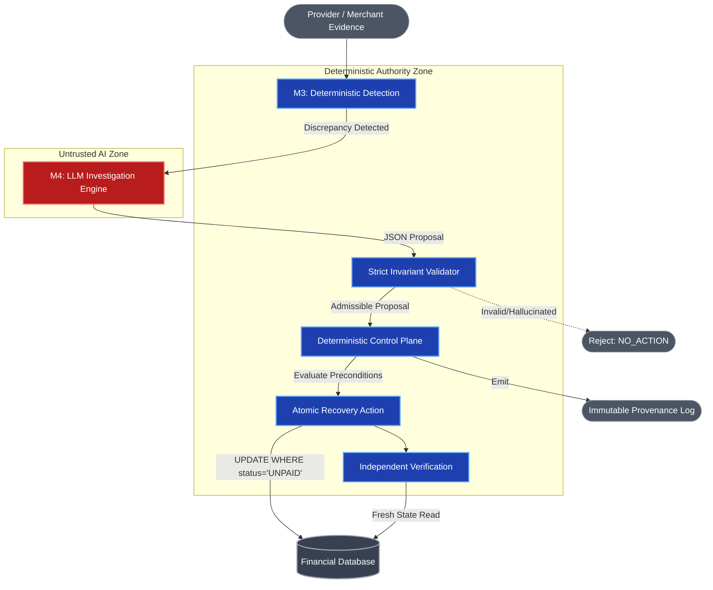

# Financial Control Engine (FCE)

**FCE does not give an AI agent permission to fix financial data. It uses AI to investigate a deterministically detected discrepancy, then requires an independent control plane to authorize a narrowly bounded repair.**

## What is FCE?
The Financial Control Engine (FCE) is a proof-of-concept pipeline demonstrating **autonomous repair within a deterministic, pre-authorized control boundary**. It is designed specifically to protect the integrity of financial systems while eliminating human bottlenecks in operations. 

## The Problem
Financial systems accumulate state discrepancies continuously. A webhook drops, a network request times out, or an asynchronous process fails. The money moves, but the system doesn't know it.

Currently, humans sit between the detection of a discrepancy and its correction. We tolerate this because autonomous mutation of financial state is dangerous. If a script blindly fixes a payment status based on a bad rule, it could cause millions in losses or regulatory fines. 

## Core Thesis
**Rules are excellent at enforcing known invariants but poor at explaining heterogeneous evidence when the failure mode isn't fully encoded. LLMs are good at synthesizing heterogeneous evidence but unsafe as financial authorities.**

Use AI where ambiguity and evidence synthesis exist. Use deterministic systems where financial authority exists.

## The Hero Incident
Consider a single story:
1. A customer attempts to pay ₹5,000 via Razorpay.
2. The payment succeeds and is `CAPTURED` at the provider.
3. The webhook fails to reach the merchant, leaving the internal order stuck as `UNPAID`.
4. The customer is angry, the goods aren't shipped, and operations teams have to manually hunt down the logs, verify the Razorpay dashboard, and click "Force Paid."

FCE detects, investigates, authorizes, and safely repairs this exact incident asynchronously, proving the problem can be solved without human intervention.

## Architecture
FCE physically isolates the AI from the database.



## The Trust Boundary
The critical trust boundary is between **M4 (Untrusted Investigation)** and **Deterministic Control**. 

The M3 engine (deterministic detection) surfaces discrepancies. The M4 LLM investigates. But M4's output is treated purely as untrusted advisory material. The Control Plane takes the LLM's hypothesis, strips away the rationale, performs an independent read of the deterministic evidence, and decides if an atomic repair is mathematically permissible. 

## Safety Guarantees
FCE's architecture is rooted in production-minded engineering principles, empirically validated under tested scenarios against the following invariants:
- **LLM cannot mutate state:** The AI only outputs a schema-validated JSON proposal.
- **LLM output cannot bypass validation:** Semantic validation intercepts all hallucinated arguments.
- **Mutation requires deterministic authorization:** Strict admissibility rules in the Control Plane govern execution.
- **Atomic Preconditions:** Database changes execute via conditional `UPDATE` statements tied strictly to expected prior state (e.g. `WHERE status = 'UNPAID'`).

## Empirical Validation
We proved these invariants through rigorous local testing, carefully distinguishing between live LLM integration tests, deterministic boundary tests, and batch workloads.

### Finance Controller Batch Evaluation (Track 4 Breadth Proof)
To prove the controller can process a finance-ops workload reliably, we ran a synthetic acceptance workload of 50 financial cases through the pipeline. The batch isolates controller measurement from LLM nondeterminism and proves 100% oracle conformance without a single unauthorized mutation.

```text
FINANCE CONTROLLER — BATCH ACCEPTANCE RUN
══════════════════════════════════════════════════════

INPUT
  Records processed:                50

RECONCILIATION
  Reconciliation match rate:        27/50 = 54.0%
  Consistent (no discrepancy):      27
  Discrepant:                       23
    Actionable (Authorized):         8
    Rejected before M4/action:      15

ORACLE CONFORMANCE (CLASSIFICATION)
  Expected classifications:         50
  Correct:                          50
  Incorrect:                        0
  Conformance:                      100.0%

ORACLE CONFORMANCE (CONTROLLER OUTCOME)
  Expected outcomes:                50
  Correct outcomes:                 50
  Incorrect outcomes:               0
  Conformance:                      100.0%

CONTROL OUTCOMES
  Automatically resolved:            8
  Safely refused / rejected:        15
  Conflicts (TOCTOU):                0
  Verification failures:             0

OPERATIONS
  M4 investigations:                 21
  Financial mutations:               8

SAFETY
  Unauthorized mutations:            0   ✓
  False autonomous actions:          0   ✓

UNRESOLVED EXCEPTION LIST
  PAYMENT_NOT_CAPTURED     × 6  — provider not yet settled, no repair path
  AMOUNT_MISMATCH          × 4  — amount delta detected, no repair path
  CURRENCY_MISMATCH        × 3  — currency mismatch, no repair path
  IDENTITY_UNKNOWN         × 2  — order identity cannot be verified

EVALUATION THROUGHPUT
  Processing time:        0.15 s
  Evaluation throughput:  340.2 records/sec
  Environment:            PostgreSQL (test isolated)
  LLM:                    deterministic mock (canonical V1 demo runner — to be finalized in the V1 demo phase)
══════════════════════════════════════════════════════
```

### The 1 -> 0 -> 0 Boundary Proof (Mocked & Deterministic)
By isolating the control plane from LLM flakiness, we empirically validate the financial invariants hold under tested scenarios:
- **Initial Authorized Mutation = 1:** The system successfully detects a stale order, processes an admissible proposal, strictly verifies the facts, and conditionally mutates the database exactly once.
- **Replay Mutation = 0:** When fed duplicate webhooks or re-triggered on the identical incident, the deterministic `UNPAID` gate idempotently blocks secondary mutations.
- **TOCTOU Race Mutation = 0:** When simulated under high-concurrency (Time-Of-Check to Time-Of-Use), the atomic database predicate catches the race condition and safely rolls back, returning a `CONFLICT` rather than a false positive.

### The Hallucination Defense (Live Qwen3)
**The strongest demonstration isn't when the AI gets the answer right. It's when the AI gets the answer wrong and the financial system still refuses to trust it.**

In our adversarial runs, the local Qwen3 model was explicitly prompted to hallucinate evidence IDs. The semantic validator instantly intercepted the payload, and the financial system refused to authorize a repair. The AI failed safely. 

## Demo
Please see our detailed demo narrative and walkthrough in `docs/DEMO_NARRATIVE.md` to see the exact CLI flow, or check out our presentation video.

## Limitations
Please review the [V0 Threat Model](docs/THREAT_MODEL_V0.md) for explicit boundaries on what this architecture guarantees and what it deliberately defers (such as distributed durable state guarantees, arbitrary multi-tenant architectures, or production-scale async queues). FCE is a proof-of-concept for the trust boundary, not a drop-in enterprise platform.
